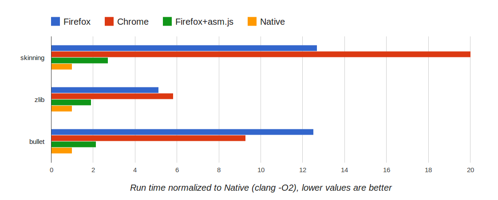
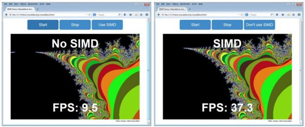
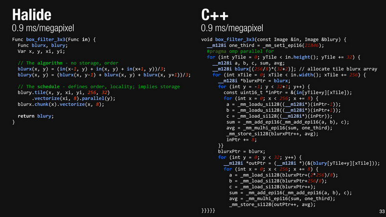
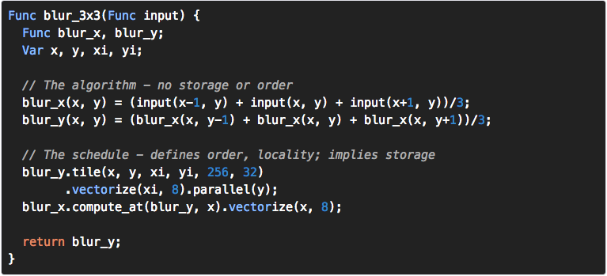

+++
title =  "Computer vision Digest - May 2014"
date = "2014-05-30"
tags =  ["news", "digest"]
+++

This is a first issue of monthly computer vision digest - a list things that you don't wanna miss, a list of what happened
in computer vision in May 2014.

In this issue:
 - [Browser image processing - how fast is it?](#1)
 - [Object recognition using neural networks via JavaScript](#2)
 - [NASA shares it's own computer vision library](#3)
 - [Easy optimization of image processing pipelines using decoupling algorithms](#4)
 - [OpenCV Apparel Store](#5)

## Browser image processing - how fast is it?

Real-time image processing gets more and more demanded and popular since computer power grows and now it's possible to decode video, apply additional filters in real-time to play HD video smoothly. On desktop platforms this is not a "wow" anymore. In contrast, in web we cannot brag such results. So, Russian-speaking readers can stop reading here and visit original article: [Оценка возможности постобработки видео в браузере][browser-imgproc]. For others I wrote a translation of this post in a free form with my 5 cents.

Strictly speaking there are two options at the moment: either we use JavaScripts (pure JS, Asm.js or SIMD.js) or apply WebGL to utilize GPU.

### JavaScript way

The image processing in JavaScript using Canvas.getImageData is slow like hell. On 1080p frames, getting frame-buffer from canvas can take up to 30ms on the desktop. 
Regardless of the JavaScript runtime performance, the limiting factor for large images is Canvas - at the moment it is not optimized for frequent read/write access.

This is not all bad news - JavaScript is slow regardless of Canvas. Simple 3x3 box blur needs approximately 400ms to process single image frame:

    function blur(source, width, height) {
        function blur_core(ptr, offset, stride) {
            return (ptr[offset - stride - 4] +
                    ptr[offset - stride] +
                    ptr[offset - stride + 4] +
                    ptr[offset - 4] +
                    ptr[offset] +
                    ptr[offset + 4] +
                    ptr[offset + stride - 4] +
                    ptr[offset + stride] +
                    ptr[offset + stride + 4]
                    ) / 9;
        }

        var stride = width * 4;
        for (var y = 1; y < (height - 1); ++y) {
            var offset = y * stride;
            for (var x = 1; x < stride - 4; x += 4) {
                source[offset] = blur_core(source, offset, stride);
                source[offset + 1] = blur_core(source, offset + 1, stride);
                source[offset + 2] = blur_core(source, offset + 2, stride);
                offset += 4;
            }
        }
    }  

### asm.js

This JavaScript subset from Mozilla pretends to be extraordinarily optimizable code. This sub-language effectively describes a safe virtual machine for memory-unsafe languages like C or C++. A combination of static and dynamic validation allows JavaScript engines to employ an ahead-of-time (AOT) optimizing compilation strategy for valid asm.js code. 

Well, it's hard to say writing asm.js code is fun. Be prepared to write code like this:

    for (i = 1; (i | 0) < (ntp | 0); i = (i | 0) + 1 | 0) {
        // tp[i] = 2 * tp[i - 1]
        tp[(i << 3) >> 3] = +(+2 * tp[((i - 1) << 3) >> 3]);
    }  

Or this:

    function f(x, y) {
        // SECTION A: parameter type declarations
        x = x|0;      // int parameter
        y = +y;       // double parameter

        // SECTION B: function body
        log(x|0);     // call into FFI -- must force the sign
        log(y);       // call into FFI -- already know it's a double
        x = (x+3)|0;  // signed addition

        // SECTION C: unconditional return
        return ((((x+1)|0)>>>0)/(x>>>0))|0; // compound expression
    }

And all you get for this hard to read code is 2x speed-up. Not impressed.

### SIMD.js

This one works only in Firefox Nightly builds and Chrome, and utilize parallelism to deliver high performance within a constrained power budget.  Through Single Instruction, Multiple Data (SIMD) instructions, processors exploit the fine-grained parallelism in applications by simultaneously processing the same operation on multiple data items, delivering major performance improvements at high power efficiency. SIMD is particularly applicable to common computations in image/audio/video processing including computer vision and perceptual computing. 

This library promised up for 400% speedups using floating-point computing:

The API looks much better:

Did I mention that SIMD.js was made by [Intel](https://01.org/node/1495)? 

### WebGL

This is orthogonal to what we considered before. WebGL is an API to GPU, and native OpenGL driver. Initially it was intented to be used in 3G graphics and gaming, but no one can prevent you to utilize General Purpose GPU (GPGPU) for image processing. Unfortunately, you will have to write shaders in very limited GLSL shading language which lacks of many cool features that are present in CUDA or OpenCL. But still, it is much faster than CPU way. 

### Conclusion

At this moment, the only reasonable technology you may want to consider for real-time image processing is WebGL. You can think about CPU image processing only if you need to process small images or there is no neeed to fit in real-time. 

## Object recognition using neural networks via JavaScript

It can take years to master neural networks. Researchers spend enormous amount of time and efforts to study them and train networks to make them remember, predict and learn.
Neural networks are good for object recognition purpose when you have a fixed set of objects you want to recognize. In this sense they are like Haar Cascades. In contrast, NN can distinguis between 1000 object categories, while Haar Cascade classifier used to detect a single kind of object that can vary (The most popular use of cascades - face detection). 

To demonstrate you the potential of NN, here is one example from [Large Scale Visual Recognition Challenge 2012](http://www.image-net.org/challenges/LSVRC/2012/results.html): 
The SuperVision team won the *first place* using deep convolutional neural network trained on raw RGB  pixel values. The neural network, which has 60 million parameters and 650,000 neurons, consists of five convolutional layers, some of which are followed by max-pooling layers, and three globally-connected layers with a final 1000-way softmax. 

**It was trained on two NVIDIA GPUs for about a week.**

This is the price NN users pay for quality. But it worth of it. 

Recenty I came across the interesting project that offers you a read-to-use implementation of similar implementation of Krizhevsky architecture in form of SDK for iOS, Android and even JavaScript!

<iframe src="//player.vimeo.com/video/91460768" width="500" height="281" frameborder="0" webkitallowfullscreen mozallowfullscreen allowfullscreen></iframe> 
<a href="http://vimeo.com/91460768">Deep Belief SDK Demo</a> from <a href="http://vimeo.com/petewarden">Pete Warden</a> on <a href="https://vimeo.com">Vimeo</a>.

So, please welcome [Deep Belief SDK][deep-beleif].

## NASA shares it's own computer vision library

The NASA Vision Workbench (VW) is a general purpose image processing and computer vision library developed by the Autonomous Systems and Robotics (ASR) Area in the Intelligent Systems Division at the NASA Ames Research Center. VW has been publicly released under the terms of the NASA Open Source Software Agreement.

The Vision Workbench was implemented in the C++ programming language and makes extensive use of C++ templates and generative programming techniques for conciseness of expression, efficiency of operation, and generalization of implementation.

I suggest for everyone who works in computer vision to look at the source code of this library. The design of this library is very unusual - you will not find a direct memory 
access there. Instead, all algorithms uses iterators, locators and templates. This produce a clean and very self-explanatory code:

    template <class SrcT, class DestT>
    void convolve_1d( SrcT const& src, DestT const& dest, std::vector<KernelT> const& kernel ) const {
      typedef typename SrcT::pixel_accessor SrcAccessT;
      typedef typename DestT::pixel_accessor DestAccessT;
      typedef typename DestT::pixel_type DestPixelT;
      typedef typename CompoundChannelType<DestPixelT>::type channel_type;

      VW_ASSERT( src.planes() == dest.planes(), ArgumentErr() << "convolve_1d: Images should have the same number of planes" );

      SrcAccessT splane = src.origin();
      DestAccessT dplane = dest.origin();
      for( int32 p=0; p<dest.planes(); ++p ) {
        SrcAccessT srow = splane;
        DestAccessT drow = dplane;
        for( int32 y=0; y<dest.rows(); ++y ) {
          SrcAccessT scol = srow;
          DestAccessT dcol = drow;
          for( int32 x=0; x<dest.cols(); ++x ) {
            *dcol = channel_cast_clamp_if_int<channel_type>( correlate_1d_at_point( scol, kernel.rbegin(), kernel.size() ) );
            scol.next_col();
            dcol.next_col();
          }
          srow.next_row();
          drow.next_row();
        }
        splane.next_plane();
        dplane.next_plane();
      }
    }

I recommend to take a look in this library to improve your language skills and have look on alternative approach how computer vision library can looks like.

Github: [nasa/visionworkbench][nasa-vision].

## Easy optimization of image processing pipelines using decoupling algorithms

Take a look on picture below. Which code you find easier to percept? Both produce identical results, they have equal speed. But which one is easier to read and understand? 

Very often I find myself thinking about how bored I am with tuning function with SSE, NEON or Assembly language. Real-time image processing requires you to count every millisecond, so sometimes you have to optimize slow functions, change a pipeline to 'fuse' results or modify data flow to ensure better data locality. SIMD, GPGPU are good, not doubts. But they does not provide a final solution to fundamental problem - in my opinion, imperative approach limit the way you implement particular algorithm.

There is a great idea - to separate Algorithm from it's Implementation. Why this matters? 
 - Writing fast image processing pipelines is hard
 - C-parallelism + tiling + fusion are hard to write or automate
 - CUDA, OpenCL, shaders - data parallelism is easy, fusion is hard
 - BLAS, IPP, OpenCV, MKL - optimized kernels compose into inefficient pipelines (no fusion)

Proposed solution: Decouple Algorithm from Schedule

*Algorithm* defines *what* is computed.
*Schedule* defines *where* and *when* it's computed.

Such decoupling lets developers a to build pipelines easy by defining a pure functions that operates on data in easy and clean way. No need to worry on tiling, parallelism and fusion. From the other side it will let the compiler to generate fast code.

I want present you Halide - the image processing language that let's you to write highly efficient code with less headache. Just compare two implementations of 

Here is an example written in Halide:

Even without experience with Halide, it is more or less clear what this code does. The Algorithm is separated from Schedule in very elegant way. During compilation stage,
Halide compiler will generate C++ code for particular platform. 

### Presentation slides on Halide language:

 

Original article: [Decoupling algorithms from schedules for easy optimization of image processing pipelines][decoupling].

## OpenCV Apparel Store

This is less technical topic for the end of this digest. If you feel ok to support OpenCV open-source library - this one is for you.
What about having a T-shirt or hoodie with OpenCV logo?

A nice way to say "thanks" to OpenCV team :)

Store webpage: [OpenCV Apparel Store][opencv-store].

## The End

That's all folks! I hope you enjoyed this digest. Please, leave your and feedbacks in comments. Please let me know if you interested in getting this digest on regular basis! 

[opencv-store]: http://fhstore.com/shopping/FHShop2.aspx?PON=74808&CON=75944&SCN=19&CN=76&ASN=&VSN=&AC=
[nasa-vision]: https://github.com/nasa/visionworkbench
[cimg]: http://cimg.sourceforge.net/
[decoupling]: http://people.csail.mit.edu/jrk/halide12/
[deep-beleif]: https://www.jetpac.com/developer
[browser-imgproc]: http://habrahabr.ru/post/221619/
