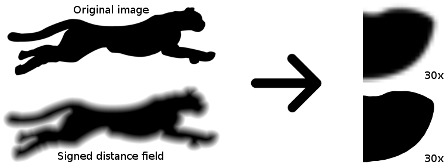
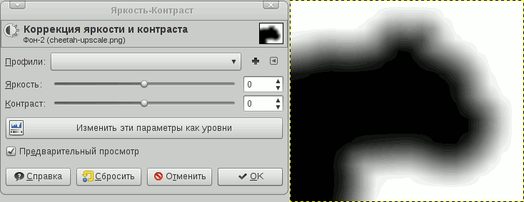
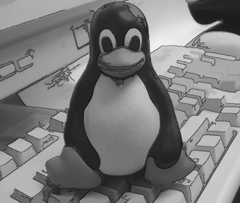
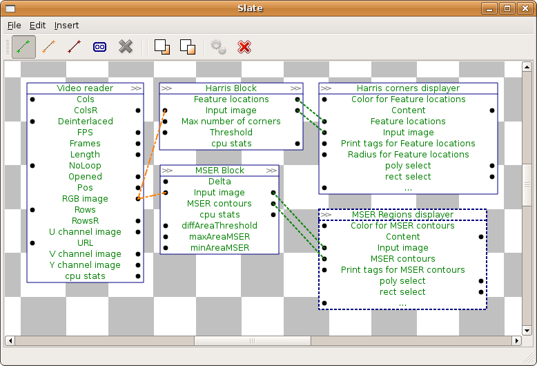
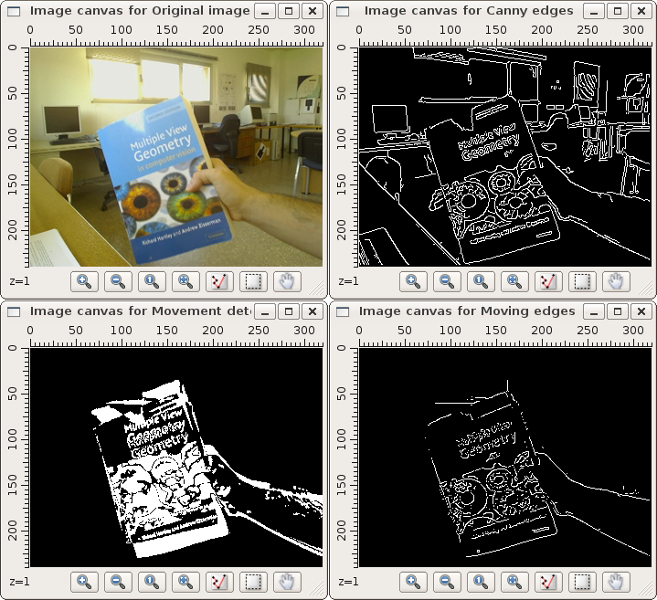
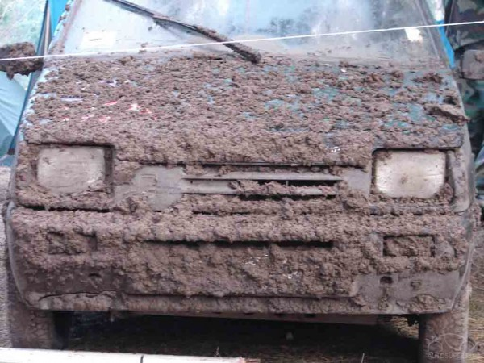
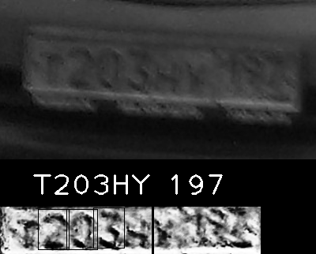

+++
title =  "Computer vision Digest - June 2014"
date = "2014-07-05"
tags =  ["news", "digest"]
+++

This is a second issue of monthly computer vision digest - a list things that 
you don't wanna miss, a list of what happened in computer vision in June 2014.

Previous issues:
 - [Computer Vision Digest (May 2014)](/articles/2014-05-computer-vision-digest/)

In this issue:
 - [Signed Distance Field - converting raster masks to vector form](#1)
 - [QVision: Computer Vision Library for Qt](#2)
 - [Closer look on licence plate recognition](#3)
 - [OpenCV 3.0](#4)

Feel free to leave your suggestions on interesting materials in post comments 
or via Twitter by mentioning [@cvtalks](https://twitter.com/cvtalks). 
Best links will be included into next digest!

# Signed Distance Field - converting raster masks to vector form

The original paper written in Russian, but the topic is rather interesting. 
It describe how to render high-resolution "vector" graphics from small raster images.
That's why I decided to include this into digest. 

The key algorithm that allows to convert raster mask to vector repesentation 
form is [distance transform][distance_transform] - algorithm, which calculates 
distance from every binary image pixel to the nearest zero pixel. 

Consider following example:

The SDF image we compute from original image can be significatly scaled down to, but it still can be used to render 
image with large zoom without aliasing artifacts that typical for raster rendering. 

Paper in russian: [Signed Distance Field или как сделать из растра вектор](http://habrahabr.ru/post/215905/).

This algorithm was developed by Valve and presented at SIGGRAPH 2007. You can read original paper:
[Improved Alpha-Tested Magnification for Vector Textures and Special Effects](http://www.valvesoftware.com/publications/2007/SIGGRAPH2007_AlphaTestedMagnification.pdf). Special thanks to @jin for the link.

# QVision: Computer Vision Library for Qt

The [QVision][qvision] is a free and open source library oriented to the development of computer vision, image/video processing, and scientific computing applications. It is based on the Qt application framework, so it is an object-oriented and cross-platform library for C++.

The library is mainly intended for educational and research purposes, usability and performance. It has a clean and well documented, Qt-style, object oriented API, which provides functionality for:

 - Video and image input/output.
 - Image processing.
 - Graphical interface programming.
 - Augmented reality visualization.
 - Performance evaluation.
 - Scientific computing (matrix, vector, quaternions, function optimization, etc..).
 - Visual data-path editor tool for rapid application development (RAD).
 - ... and so on.

I liked this library because it allows to desing algorithm using graph concept:

Visual designer allows you to connect data sources with image filters that transform one source 
to another and connect filters in a chain to build a computer vision pipeline without wiring 
any single line of code.

I beleive this kind of playground can be very useful for fast prototyping and learning basics 
of computer vision. The visual designer does not require any knowledge of any computer vision 
library (like OpenCV or Halcon). 

Project homepage: [QVision][qvision].

# Closer look on licence plate recognition

Again, another publication in Russian, but hey, it's still worth reading it, even via Google Translate. 
License plate recognition is very demanded topic and there are many systems for that. But what about 
knowledge sharing? Guys from Recognitor share their experience with recognizing plate numbers in very, 
very unfriendly conditions - dirty numbers, dark and blurred.

Here are key features of their implementation:

 * Small rotation invariance to plate rotation (± 10 degree)
 * Perspective scale invariance (20%)
 * Robustness to partial occlusion of the license plate

Usually, the first step in system like that is image binarisation. This works fine when we have a clean number and 
friendly lighting conditions. In other cases this method does not help at all. A better approach is to find top and 
bottom lines of the plate using brightness histogram. 

 1. Detect bottom border
 1. Detect top border
 1. Detect left and right borders
 1. Increase contrast in ROI
 1. Split symbols 
 1. Symbol matching 

To attract your attention - here is an example of what their algorihtm is capable to recognize:

Impressed? So am I was. Original post: [Распознавание автомобильных номеров в деталях](http://habrahabr.ru/company/recognitor/blog/225913/).

# OpenCV 3.0

No, it has not yet released. But if you build latest revision of master branch, CMake will happily report:

    OpenCV ARCH: x86
    OpenCV RUNTIME: vc12
    OpenCV STATIC: ON
    Found OpenCV 3.0.0 

As you may read in my blog I [ported](/articles/kaze-1.6-in-opencv/) of KAZE features to OpenCV. And I proud that 
my contribution will be a part of next OpenCV release.

OpenCV team has not made any announcement about 3.0 release date. Personally I'd expect it 
to happed at the end of GSoC. So let's keep fingers crossed.

Meanwhile, here is a presentation that can reveal some details of what you can expect from OpenCV 3.0:

<iframe src="//www.slideshare.net/slideshow/embed_code/36806594" width="800" height="600" frameborder="0" marginwidth="0" marginheight="0" scrolling="no"></iframe>

 [qvision]: http://qvision.sourceforge.net/index.html
 [distance_transform]: http://docs.opencv.org/modules/imgproc/doc/miscellaneous_transformations.html#distancetransform

